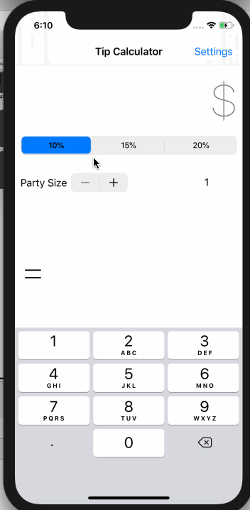

# TipCalculator

# Pre-work - Tip Calculator

**Tip Calculator** is a tip calculator application for iOS.

Submitted by: **Aryan Vaid**

Time spent: **5** hours spent in total

## User Stories

The following **required** functionality is complete:

* [x] User can enter a bill amount, choose a tip percentage, and see the tip and total values.
* [x] User can select between tip percentages by tapping different values on the segmented control and the tip value is updated accordingly

The following **optional** features are implemented:

* [x] UI animations
* [x] Using locale-specific currency.
* [x] Making sure the keyboard is always visible and the bill amount is always the first responder. This way the user doesn't have to tap anywhere to use this app. Just launch the app and start typing.

## Video Walkthrough

Here's a walkthrough of implemented user stories:

